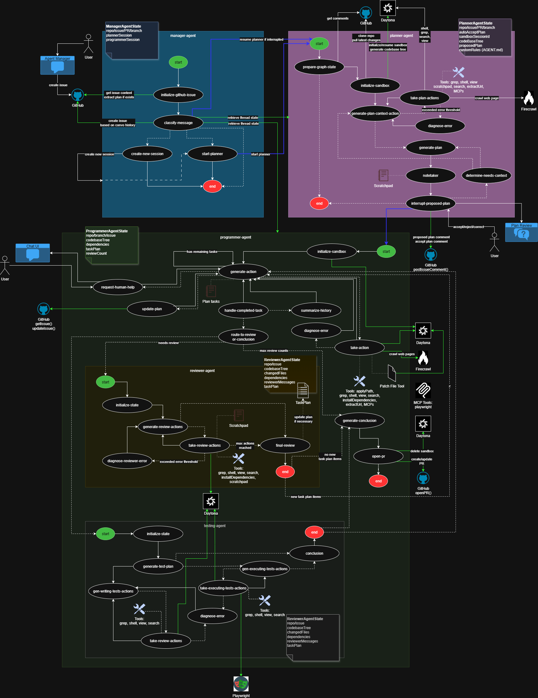
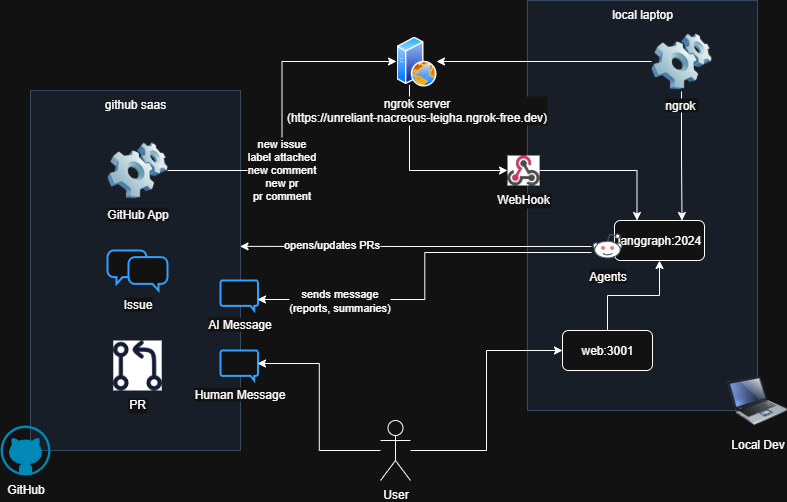

# Software Engineer Agent for Enterprise Development

*An extension of [Open SWE](https://github.com/langchain-ai/open-swe) by LangChain*

> **⚠️ Prototype Status**: This is prototype work in progress. Some functionality might not be fully tested or stable. Use with caution in production environments.

## Abstract
This project provides an AI software engineer that automates the complete software development lifecycle—from requirements analysis and architecture design to implementation, testing. Built as an extension of LangChain's Open SWE project, it acts as an autonomous development team member, creating production-ready code, comprehensive test suites, and maintaining high software quality standards for enterprise organizations.

## Motivation
Enterprise software development faces unique challenges: complex requirements, strict compliance needs, extensive testing requirements, and the need for maintainable, scalable solutions. Manual development processes are bottlenecks in modern enterprises where speed and quality are both critical. This project solves these challenges by providing an AI agent that can understand business requirements, design appropriate solutions, implement code following enterprise standards, create comprehensive tests, and ensure quality—all while maintaining the rigor and documentation standards expected in enterprise environments.

## System Design
The diagram below illustrates the end-to-end architecture of the Software Engineer Agent. It shows how the Manager Agent coordinates specialized sub-agents for planning, programming, reviewing, and testing. The system integrates with GitHub for issue tracking and pull requests, uses sandboxed environments for safe code execution, and includes comprehensive testing capabilities via Playwright. State management ensures consistent tracking of tasks, code changes, and quality metrics throughout the development lifecycle.



## System Overview

### Cognitive Architecture
- **Manager Agent**: Orchestrates the complete development workflow, manages task delegation, and ensures quality gates
- **Planner Agent**: Analyzes requirements, designs architecture, and creates detailed implementation plans
- **Programmer Agent**: Implements code, handles complex programming tasks, and manages technical debt
- **Reviewer Agent**: Conducts code reviews, ensures quality standards, and validates implementations
- **Testing Agent**: Creates comprehensive test suites, runs E2E tests, and ensures code reliability

### Requirements Analysis & Planning
- **Issue Processing**: Uses NLP to extract requirements from GitHub issues, user stories, and specifications
- **Architecture Design**: Creates system design documents, API specifications, and technical architecture plans
- **Task Decomposition**: Breaks complex features into manageable development tasks with clear acceptance criteria

### Code Generation & Implementation
- **Enterprise Patterns**: Generates code following enterprise architectural patterns (MVC, DDD, microservices)
- **Technology Stack Integration**: Supports multiple languages, frameworks, and enterprise technologies
- **Code Quality**: Implements SOLID principles, design patterns, and enterprise coding standards

### Quality Assurance & Testing
- **Automated Testing**: Creates unit tests, integration tests, and end-to-end test suites
- **Code Review**: Performs automated code reviews with quality metrics and improvement suggestions
- **Compliance Checking**: Validates code against security, performance, and compliance requirements

### GitHub Integration
- **Issue-to-PR Workflow**: Automatically converts GitHub issues into pull requests with complete implementations
- **Branch Management**: Handles feature branches, merge strategies, and git workflows
- **Documentation**: Generates comprehensive documentation, API docs, and technical specifications

## Repository Structure
```
apps/
├── open-swe/          – Core LangGraph agents and orchestration logic
├── web/               – Next.js web interface for agent interaction
└── cli/               – Command-line interface for automation

packages/
└── shared/            – Common utilities, types, and shared components

graphs/
├── manager/           – Top-level orchestration and workflow management
├── planner/           – Requirements analysis and architecture design
├── programmer/        – Code generation and implementation
├── reviewer/          – Code review and quality assurance
└── testing/           – Automated testing and quality validation

tools/
├── code-generation/   – Advanced code generation and templating
├── testing/           – Testing frameworks and automation
├── github/            – GitHub API integration and workflow management
└── security/          – Security scanning and compliance checking

docs/                  – Architecture diagrams, guides, and specifications
tests/                 – Integration tests and agent validation
static/                – UI assets and documentation images
```

## Setup Instructions

### Prerequisites
- **Node.js** (v18+) with Yarn package manager
- **TypeScript** (v5+) for type safety and enterprise development
- **Docker** (optional) for containerized deployments
- **GitHub** account with appropriate repository access

### Node.js & Dependencies
```bash
# Install dependencies
yarn install

# Verify installation
yarn --version
node --version
```

### Environment Configuration
```bash
# Copy environment template
cp .env.example .env

# Configure required variables
ANTHROPIC_API_KEY=your_anthropic_key_here
GITHUB_TOKEN=your_github_token_here
GITHUB_INSTALLATION_ID=your_app_installation_id
```

### Agent Development Environment
```bash
# Build shared packages
yarn build

# Start development server
yarn dev

# Run agent locally
yarn start:agent
```

### LangGraph Studio Integration
```bash
# Launch LangGraph Studio for visual debugging
langgraph dev

# Access Studio UI
open http://localhost:2024
```

## Secrets & Configuration

### GitHub Integration
Set up GitHub App for enterprise integration:
```bash
# GitHub App configuration
GITHUB_APP_ID=your_app_id
GITHUB_PRIVATE_KEY=your_private_key
GITHUB_WEBHOOK_SECRET=your_webhook_secret
```

### Model Configuration
Configure AI models for different agents:
```bash
# Primary programming model
PROGRAMMER_MODEL=claude-3-5-sonnet-20241022
PLANNER_MODEL=claude-3-5-sonnet-20241022
REVIEWER_MODEL=claude-3-5-sonnet-20241022

# Testing and analysis models
TESTING_MODEL=claude-3-5-sonnet-20241022
```

### Enterprise Security
```bash
# Security and compliance
SECURITY_SCAN_ENABLED=true
COMPLIANCE_RULES=enterprise-standard
VULNERABILITY_DB_URL=your_vuln_db_endpoint
```

## Running the Project

### Local Development
```bash
# Start the complete agent system
yarn dev

# Access web interface
open http://localhost:3000

# Access API documentation
open http://localhost:3000/api/docs
```

### Production Deployment
```bash
# Build for production
yarn build

# Deploy to enterprise infrastructure
yarn deploy:prod

# Monitor agent performance
yarn monitor
```

### GitHub Webhook Integration
```bash
# Configure webhook endpoint
WEBHOOK_URL=https://your-domain.com/api/webhooks/github

# Test webhook connectivity
yarn test:webhooks
```

## Usage

The Software Engineer Agent can be used in multiple ways:

- 🖥️ **From the UI**: Create, manage and execute development tasks from the web application. The interface provides real-time visibility into agent progress, code changes, and quality metrics.
- 📝 **From GitHub**: Start development tasks directly from GitHub issues by adding specific labels
- 🔗 **API Integration**: Use REST APIs to integrate with existing enterprise systems and workflows
- 📊 **Analytics Dashboard**: Monitor development metrics, quality trends, and agent performance

## GitHub Workflow Integration

The Software Engineer Agent integrates seamlessly with GitHub through webhooks, providing a streamlined workflow where you can request code changes by simply adding labels to issues in repositories where the agent is installed.



### Technical Webhook Implementation

The webhook integration operates through a sophisticated event-driven architecture that transforms GitHub issue events into automated development workflows:

#### Webhook Event Processing
1. **GitHub Event Capture**: When a label is added to an issue, GitHub sends a `issues.labeled` webhook payload to the agent's endpoint (`/api/webhooks/github`)
2. **Signature Verification**: The webhook handler validates the GitHub signature using HMAC-SHA256 with the configured webhook secret to ensure request authenticity
3. **Event Filtering**: The system filters for supported label patterns (`open-swe*`, `software-engineer*`) and ignores irrelevant events
4. **Payload Extraction**: Critical data is extracted including issue title, body, repository context, user information, and label metadata

#### Authentication & Authorization
- **GitHub App Authentication**: Uses GitHub App installation tokens with repository-scoped permissions
- **User Validation**: Verifies the label-adding user has appropriate repository access and is authorized to trigger runs
- **Installation Context**: Validates the GitHub App is properly installed on the target repository with necessary permissions

#### Run Creation Pipeline
1. **Thread Generation**: Creates a unique thread ID using UUID for conversation tracking and isolation
2. **Graph State Initialization**: Constructs the initial `GraphState` object with issue context, repository metadata, and execution parameters
3. **Mode Configuration**: Determines execution mode (manual/auto) based on label type and sets `auto_accept` flag accordingly
4. **Manager Graph Invocation**: Starts the LangGraph Manager workflow with the configured state and streaming enabled
5. **Database Persistence**: Stores run metadata, thread association, and execution state in the backend database

#### Real-time Communication
- **Streaming Architecture**: Uses Server-Sent Events (SSE) for real-time progress updates to the web interface
- **WebSocket Fallback**: Implements WebSocket connections for browsers that don't support SSE properly
- **Progress Tracking**: Maintains execution state across graph nodes with detailed logging and error handling

#### Issue Comment Integration
- **Automatic Notifications**: Posts status comments on the GitHub issue using the GitHub API with installation authentication
- **Run URL Generation**: Creates secure, user-specific URLs that link directly to the run interface
- **Access Control**: Implements user-based access restrictions where only the issue creator can access the generated run
- **Status Updates**: Provides real-time status updates through issue comments as the run progresses

#### Error Handling & Recovery
- **Webhook Retry Logic**: Implements exponential backoff for failed webhook deliveries with GitHub's retry mechanism
- **State Recovery**: Maintains run state persistence to handle system restarts and network interruptions
- **Graceful Degradation**: Continues operation even if secondary services (notifications, logging) are temporarily unavailable
- **Audit Trail**: Comprehensive logging of all webhook events, state transitions, and error conditions

### Triggering Runs with Labels

The agent monitors GitHub issues for specific labels that trigger automated development runs. When you add one of these labels to an issue, the agent automatically creates a new run to process your request.

#### Label Types

The agent supports multiple label types that control how it operates:

**Manual Mode (`open-swe`)**
- Requires manual approval of the generated plan before code execution
- Gives you full control over what changes will be made
- Ideal for complex or sensitive changes where you want to review the approach first

**Auto Mode (`open-swe-auto`)**
- Automatically approves and executes the generated plan
- Provides faster turnaround for straightforward requests
- Best for simple changes or when you trust the agent to proceed autonomously

**Enterprise Mode (`open-swe-enterprise`)**
- Uses enhanced models for both planning and programming tasks
- Includes comprehensive testing, security scanning, and compliance checking
- Provides enterprise-grade performance and quality assurance for critical projects

**Enterprise Auto Mode (`open-swe-enterprise-auto`)**
- Combines automatic execution with enterprise-grade capabilities
- Ideal for production environments that require both speed and quality
- Includes all enterprise features with minimal human intervention

> **Note**: In development environments, the labels are `open-swe-dev`, `open-swe-auto-dev`, `open-swe-enterprise-dev`, and `open-swe-enterprise-auto-dev` respectively.

## References & Links
- [LangGraph Documentation](https://langchain-ai.github.io/langgraph/)
- [Enterprise Architecture Guide](./docs/enterprise-architecture.md)
- [Security & Compliance](./docs/security-compliance.md)
- [API Documentation](./docs/api-reference.md)
- [Testing Status Flow](./TESTING_STATUS_FLOW.md)
- [Contributing Guide](./CONTRIBUTING.md)
